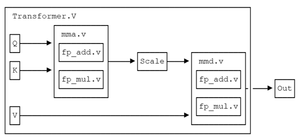
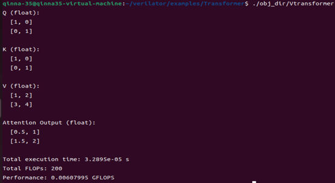
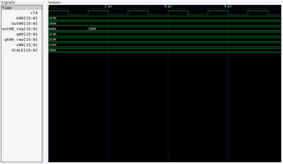

# Transformer Matrix Multiplication Accelerator Design



**Southwest Minzu University, School of Computer Science and Artificial Intelligence**  
**Major in Computer Science and Technology**  
**Author: Lina Qin**

This project implements a Transformer Matrix Multiplication Accelerator (MMA) based on Verilog, which includes a floating-point operation unit, simulation testing, and waveform visualization features. It is the practical achievement for the course "Computer System Architecture."

## Directory Structure

```text
.
├── img/
│   ├── mma.png             # Diagram of the MMA module structure
│   ├── run.png             # Screenshot of simulation execution example
│   ├── Self_attention.png  # Diagram of the self-attention mechanism
│   ├── Transformer.png     # Overall architecture diagram of Transformer
│   └── wave.png            # Example of simulation waveform
├── obj_dir/                # Directory generated by Verilator compilation (automatically generated)
├── sim/
│   ├── test_matrix.cpp     # Matrix operation test simulation program
│   └── wave.vcd            # Waveform data file (generated after simulation)
├── src/
│   ├── fp_add.v           # Floating-point adder module
│   ├── fp_mul.v           # Floating-point multiplier module
│   ├── mma.v              # Matrix Multiplication Accelerator: QxK^T
│   ├── mmd.v              # Matrix Multiplication Accelerator: Vx(QxK^T)/sqrt(d)  # +++Updated description
│   └── transformer.v      # Top-level Transformer module
└── README.md              # Project documentation
```

## Quick Start

In this study, hardware simulation mainly relies on the toolchain of Verilator, GTKWave, and G++ for implementation and verification. The Verilator version used is 5.035, GTKWave version is v3.3.10, and G++ is version 11.4.0 (Ubuntu 11.4.0-1ubuntu1~22.04). All tools are run on the Ubuntu 22.04 operating system, ensuring the stability and reliability of the entire simulation process.

### Installing Verilator on Ubuntu

```text
sudo apt-get install git help2man perl python3 make autoconf g++ flex bison ccache
sudo apt-get install libgoogle-perftools-dev numactl perl-doc
sudo apt-get install libfl2  # Only required for Ubuntu; skip if an error occurs
sudo apt-get install libfl-dev  # Only required for Ubuntu; skip if an error occurs
sudo apt-get install zlibc zlib1g zlib1g-dev  # Only required for Ubuntu; skip if an error occurs

git clone https://github.com/verilator/verilator

unset VERILATOR_ROOT  
cd verilator
git pull         # Ensure the git repository is up-to-date
git tag          # Check the version number
# git checkout v3.922 Switch to the v3.922 version branch; ignore if no version is required
autoconf         # Create the ./configure script
./configure      # Configure and create Makefile. Note that the 'make' command may take a while to complete.
make -j `nproc`  # Build Verilator itself (if an error occurs, try just 'make')
sudo make install
export VERILATOR_ROOT=$INSTALL_DIR  # Replace INSTALL_DIR with the absolute path where Verilator is installed
```

### Installing GTKWave on Ubuntu

```text
sudo apt-get install gtkwave
gtkwave --version	// Check the version to confirm successful installation
```

### Running Commands

```text
verilator -Wall --cc transformer.v --exe test_matrix.cpp --trace
make -C obj_dir -f Vtransformer.mk Vtransformer
./obj_dir/Vtransformer
```

If the execution result is as shown in the figure below, it indicates success:



## Simulation Waveform Analysis

